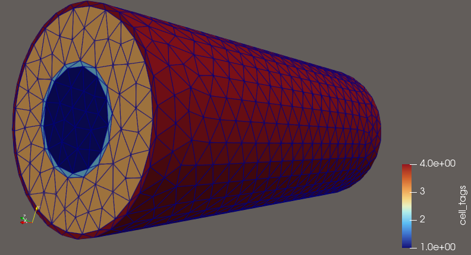

## Double pipe heat exchanger

1. Create domain
2. Proof momentum balance
3. Proof energy balace

#### $\S$ 1. Create domain

#### $\S$ 2. Proof momentum balance

N-S equation (No gravity effect)

$$
\rho \frac{\partial u}{\partial t}+\rho (u \cdot \nabla )u=-\nabla P +\mu \nabla ^2 u  
$$

Crank-Nicolson discretization for calculate.

$$
\rho \left(\frac{u^{*} -u^n}{\delta t}+\left(\frac{3}{2} u^n -\frac{1}{2} u^{n-1}\right)\cdot \frac{1}{2}\nabla (u^{*}+u^n)\right)-\frac{1}{2}\mu \nabla^2 (u^{*}+u^n)+\nabla P^{\frac{n-1}{2}}=0 $$
