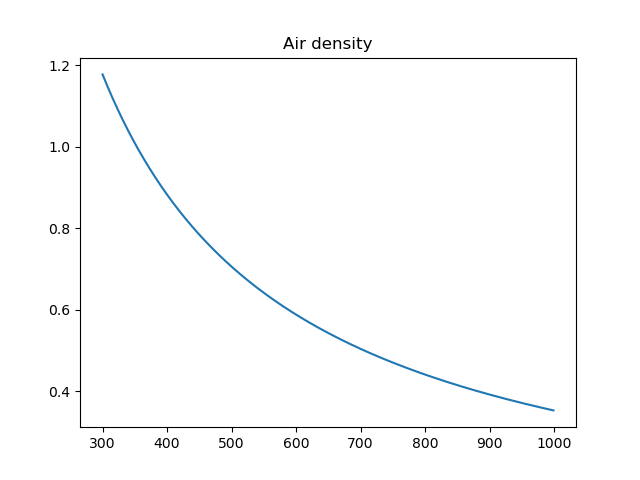
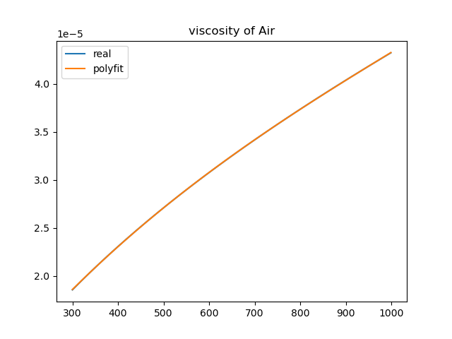
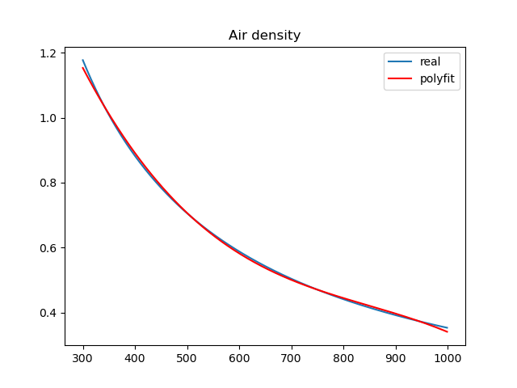
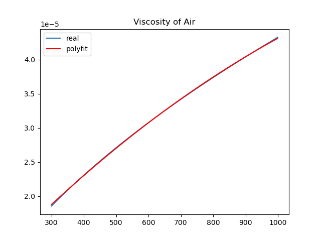
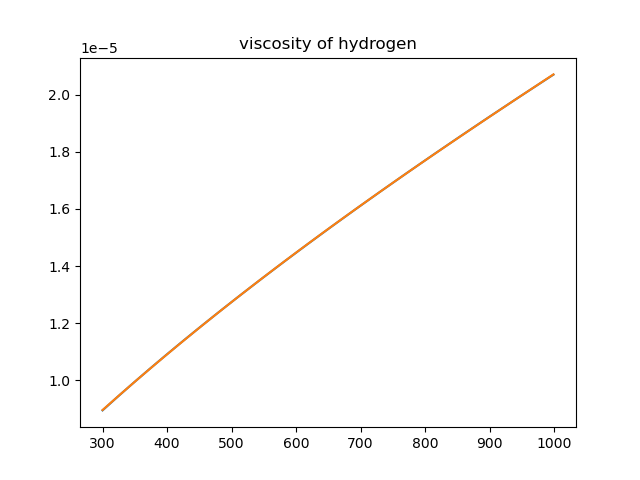
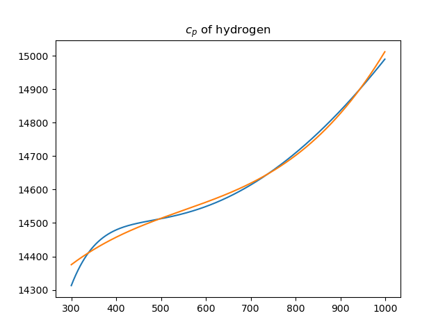
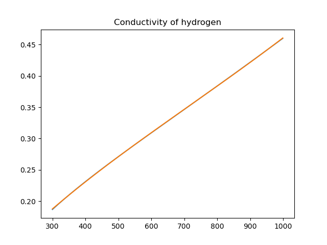

## Double pipe heat exchanger

Hot Air(1000K) flows at outer pipe.
Carbondioxide and hydrogen mixture gas flows at inner pipe(PBR).

Reaction is *Sabatier reaction*:

$$
CO_2+4H_2 \rarrow CH_4+2H_2O $$

Approximate inlet gas as fuel $H_2$ gas cause can't find data of mixture gas.

#### Index

1. Proof momentum balance
2. Proof energy balacne
3. Proof mass balace

#### $\S$ 1.1. Create domain

#### $\S$ 1.2. Pitting properties by CoolProp

Find properties's polynomial function of Temperature by numpy.polyfit().

From 300K to 1000K plot density and viscosity.

Approximate density and vicosity to degree 3.

Do same Hydrogen gas.

#### $\S$ 1.2. Calculate

N-S equation (No gravity effect)

$$
\rho \frac{\partial u}{\partial t}+\rho (u \cdot \nabla )u=-\nabla P +\mu \nabla ^2 u  
$$

Crank-Nicolson discretization for calculate.

$$
\rho \left(\frac{u^{*} -u^n}{\delta t}+\left(\frac{3}{2} u^n -\frac{1}{2} u^{n-1}\right)\cdot \frac{1}{2}\nabla (u^{*}+u^n)\right)-\frac{1}{2}\mu \nabla^2 (u^{*}+u^n)+\nabla P^{\frac{n-1}{2}}=0 $$

#### $\S$ 
