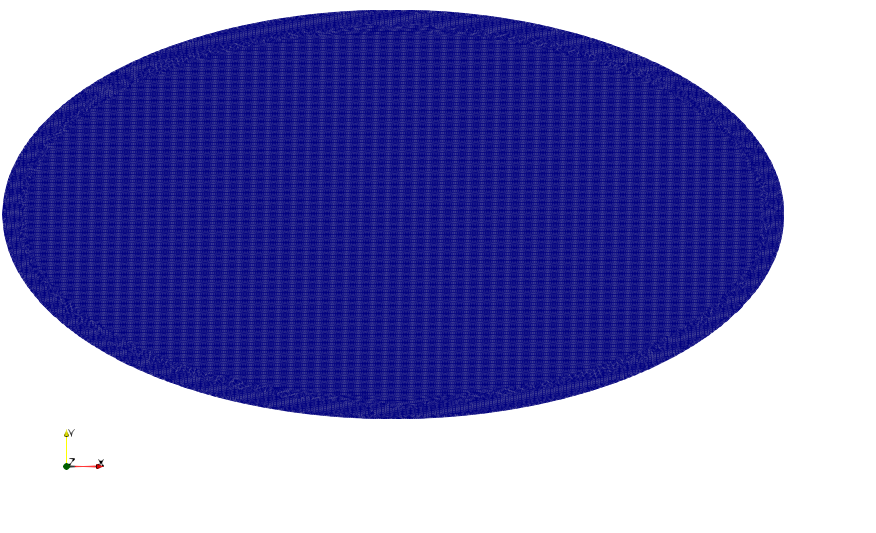
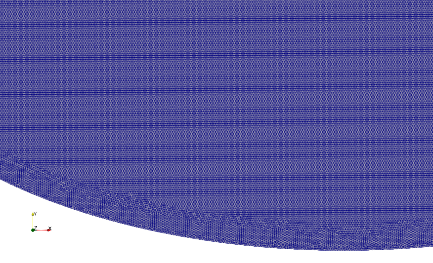

## Heat Optimize on shelled elliptic body

Inspired on baking sweatpotato.
Body has shell, stage changed by heat.(Real sweatpotato's carbonhydrate chage to sugar by heat.)
Optimizing time, heat transfer methode(radiation or convection).

#### 1. First simulation 2D.

##### Domain

Mesh with edges. MeshSizeMax is 0.01.

View shell and body.

